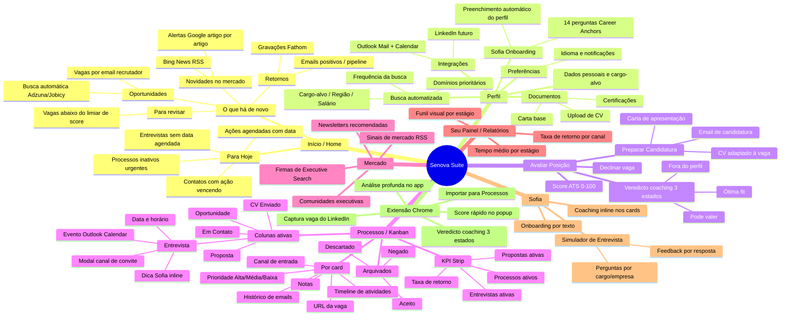
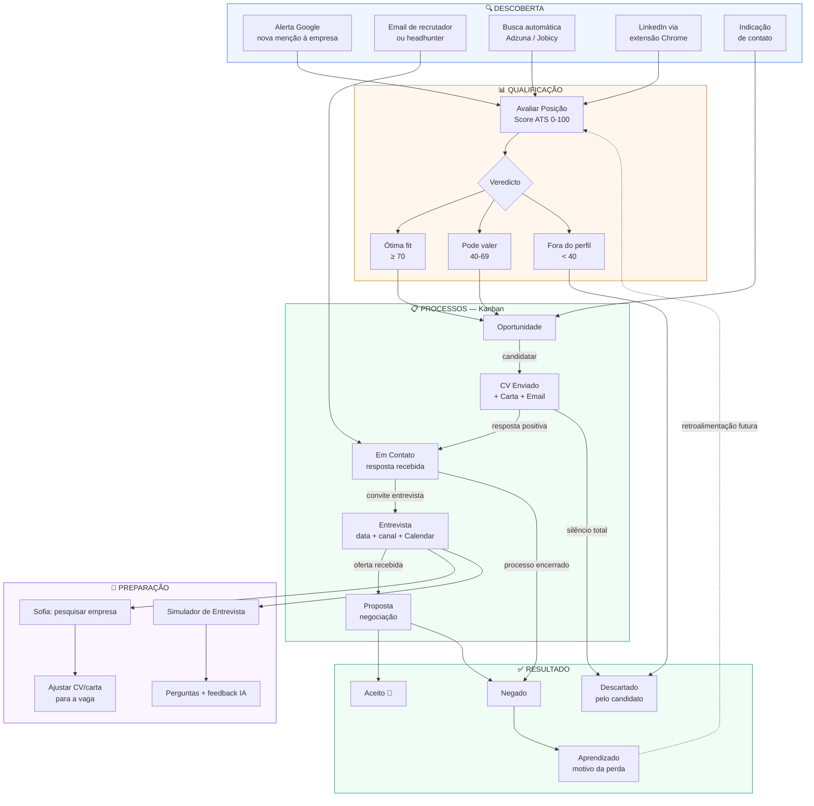
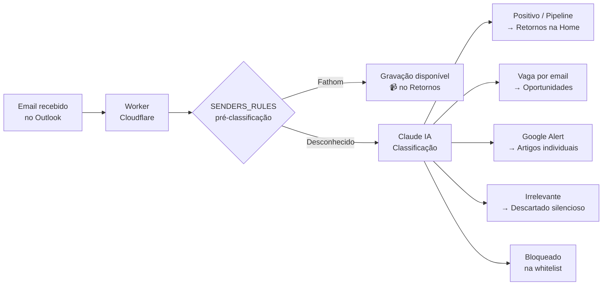

# Mapa Mental + Fluxograma — Senova Suite
# Atualizado: 09/jun/2026

---

## 1. Mapa Mental — Estrutura do Produto

---

## 2. Fluxograma — Jornada do Executivo (Funil Completo)

---

## 3. Mapa de Sinais — Como o email vira ação

---

## 4. Legenda de Status — Vocabulário Aprovado

| Status no sistema | Nome visível ao usuário | Cor |
|---|---|---|
| `lead` | Oportunidade | Cinza |
| `aplicado` | CV Enviado | Âmbar |
| `contato` | Em Contato | Azul |
| `entrevista` | Entrevista | Roxo |
| `proposta` | Proposta | Verde |
| `aceito` | Aceito | Verde escuro |
| `negado` | Não avançou | Vermelho suave |
| `descartado` | Descartado | Cinza |

---

## 5. Gaps conhecidos (visão × implementação)

| Seção | Existe | Falta |
|---|---|---|
| IEE — Índice de Empregabilidade | ❌ | Diferencial central — 5 dimensões, score holístico |
| Modo Radar (executivo empregado) | ❌ | TAM 9x — monitoramento passivo sem modo ativo |
| Aprendizado pós-resultado | ❌ | Motivo da perda, retroalimentação para o IEE |
| Simulador ligado ao card | ⚠ Órfão | Botão "Preparar" no modal de Entrevista |
| Handoff busca automática → qualificação | ❌ | "Avaliar antes de adicionar" |
| Vocabulário aprovado 100% | ⚠ Parcial | Pipeline/Varredura/CRM ainda visíveis em 6 pontos |

---

*Este arquivo é o mapa de referência do produto. Atualizar quando houver mudança estrutural.*
