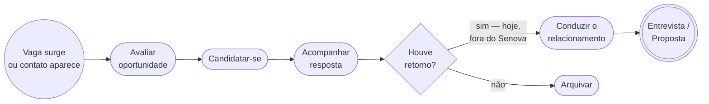
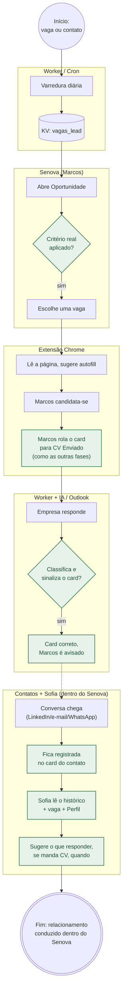

# Mapa de Processos do Senova — Diagrama, Mapa (BPMN) e Modelo (Service Blueprint)

**Sessão:** S45 · **Data:** 13/ago/2026 · **Autor técnico:** Bruno (Claude Code) · **Aprovador:** Marcos

Substitui o plano anterior ("Retomada do Senova"), que era uma lista de bugs sem estrutura de processo. Este documento aplica os três níveis clássicos de mapeamento de processos ao fluxo real de busca de emprego do Senova — Diagrama (visão ampla), Mapa (BPMN simplificado) e Modelo (recursos do negócio, AS-IS/TO-BE) — mais backlog priorizado em RICE e RACI. Espelha o [Artifact publicado](https://claude.ai/code/artifact/e59bea2a-28d8-4b22-820e-50a76cc99c3c), guardado aqui para consulta e validação fora da sessão de chat.

> **Por que Service Blueprint, não BPMN rico, na camada de Modelo:** BPMN nasceu para reengenharia de processo industrial/administrativo. Para um SaaS, a técnica mais específica — e mais usada por times de produto — é o **Service Blueprint** (Shostack, refinado pela Nielsen Norman Group para produto digital). Ele acrescenta o que o BPMN não tem: a **linha de visibilidade**, separando o que o usuário vê (front-stage) do que roda por trás (back-stage), mais a evidência em cada ponto de contato.

---

## 1. O processo

| Campo | Descrição |
|---|---|
| Nome | Busca e condução de oportunidades de trabalho (ponta a ponta) |
| Dono do processo | Marcos (usuário e owner do produto) |
| Gestor técnico | Bruno (Claude Code) |
| Gatilho de início | Uma vaga aparece (varredura automática, ou Marcos encontra por fora) OU um contato se manifesta (recrutador, RH) |
| Evento de fim | Proposta aceita/recusada, ou vaga arquivada como não-viável |
| Fora de escopo (por ora) | Escola do Bosque, módulos de plano de vida além de carreira |

---

## 2. Diagrama de Processo — visão ampla

Só as atividades principais, sem sistemas nem responsáveis — para orientar antes de entrar no detalhe.

---

## 3. Mapa de Processo — AS-IS (BPMN simplificado)

Raias por responsável, eventos de início/fim e um portão de decisão. Vermelho = quebrado. Âmbar = manual/fora do Senova. Verde = funciona.

```mermaid
flowchart TB
  Start((Início:<br/>vaga ou contato))
  subgraph CRON["Worker / Cron"]
    A1["Varredura diária<br/>Adzuna + Jobicy"] --> A2[("KV: vagas_lead")]
  end
  subgraph APP["Senova (Marcos)"]
    B1["Abre Oportunidade"] --> B2{"Critério real<br/>aplicado?"}:::bad
    B2 -->|"não, hoje — bug G1"| B3["Reduz critério no Perfil<br/>na mão, para destravar"]:::warn
    B3 --> B4["Escolhe uma vaga<br/>e abre pelo Copiloto"]
  end
  subgraph EXT["Extensão Chrome"]
    C1["Lê a página da vaga"] --> C2["Sugere autofill"]
    C2 --> C3["Falha em vários portais"]:::bad
    C3 --> C4["Marcos candidata-se<br/>(com ou sem ajuda)"]
    C4 --> C5{"Card avança<br/>sozinho?"}:::bad
    C5 -->|"não — bug G4"| C6["Marcos move o card<br/>na mão"]:::warn
  end
  subgraph MAIL["Worker + IA / Outlook"]
    D1["Empresa responde<br/>por e-mail"] --> D2{"Classifica e<br/>sinaliza o card?"}:::bad
    D2 -->|"não — regrediu, bug G3"| D3["Marcos só descobre<br/>abrindo o e-mail direto"]:::bad
  end
  subgraph FORA["Fora do Senova"]
    E1["Contato chega por<br/>LinkedIn / e-mail / WhatsApp"] --> E2["Marcos cola a conversa<br/>inteira no assistente externo"]:::warn
    E2 --> E3["Decide o que escrever,<br/>se manda CV, quando"]:::warn
    E3 --> E4["Resultado NÃO fica<br/>registrado no Senova"]:::bad
  end
  End(((Fim: resposta<br/>não tratada no Senova)))
  Start --> A1
  A2 --> B1
  B4 --> C1
  C6 --> D1
  D3 -.-> E1
  E4 --> End
  classDef bad fill:#fbe4df,stroke:#B3402B,color:#7a2c1c,stroke-width:1.5px;
  classDef warn fill:#faf1de,stroke:#B8862E,color:#6b4e18,stroke-width:1.5px;
```

**Legenda:** 🔴 Quebrado · 🟡 Manual / fora do sistema · 🟢 Funciona

---

## 4. Mapa de Processo — TO-BE (BPMN simplificado)

---

## 5. Diagnóstico — o gap, nomeado

| # | O que está errado | Onde | Prioridade |
|---|---|---|---|
| G1 | Oportunidade mostra vagas abaixo do critério real | index.html — `_cardIntocadoDaBusca` | Must — **fechado 13/ago (commit 1513efa)** |
| G2 | Perfil não sustenta os ajustes que o MVP exige — Marcos já teve que contornar na mão | Módulo Perfil | Must — bloqueia o MVP multiusuário |
| G3 | Detecção de resposta de candidatura por e-mail regrediu (já funcionou) | Worker — classificação de e-mail | Must — diagnóstico feito, correção pendente |
| G4 | Extensão não move o card e falha em preencher formulário em vários portais | senova-extension | Should |
| G5 | Contatos é cadastro estático; a decisão real (o que escrever, timing, CV ou não) acontece fora do Senova | Módulo Contatos | Could |
| G6 | Sofia (conselheira) projetada, nunca implementada — é o motivo de G5 existir | Módulo Sofia (não construído) | Could |
| G7 | Sem protocolo formal de que agente/skill usar por tipo de mudança | Governança | ✓ Fechado 13/ago — CLAUDE.md, Passo 0 |
| G8 | Tela "Avaliar Posição" nascia visível junto com Início no boot (flash) | index.html — `#page-ats` | ✓ Fechado 13/ago (commit 7e2866c) |
| G9 | Popup do Chrome "Atualizar senha?" disparava a cada Salvar, em qualquer tela | index.html — campo Chave de acesso | ✓ Fechado 13/ago (commit 12f6331) |

---

## 6. Modelo de Processo (Service Blueprint + recursos do negócio)

### AS-IS

*Linha de visibilidade: tudo à direita da coluna "Evidência" é back-stage / suporte — invisível para Marcos.*

| Etapa | Ação do usuário | Evidência (o que Marcos vê) | Back-stage | Sistemas de suporte |
|---|---|---|---|---|
| Descoberta | Abre Oportunidade | 400+ cards, muitos fora do critério | Peneira de score não aplicada de forma consistente (G1) | KV vagas_lead · index.html |
| Candidatura | Abre vaga pelo Copiloto, preenche/confere | Autofill falha em parte dos portais | Extensão lê DOM heterogêneo por portal | senova-extension |
| Registro | Fecha a aba, volta ao Senova | Card continua em Oportunidade | Flag otimista de candidatura não é confirmada (G4) | senova-extension ↔ D1 |
| Retorno | Nenhuma — deveria ser automático | Nenhum aviso no Senova | Classificador de e-mail parou de reconhecer resposta (G3) | Worker · Graph API · IA |
| Relacionamento | Cola a conversa inteira num assistente externo | Nada registrado no Senova | Não existe — decisão acontece 100% fora | Assistente externo (fora do Senova) |

**Recursos do negócio (AS-IS):**

| Pessoas | Informação | Automação | Infraestrutura | Finanças |
|---|---|---|---|---|
| Só Marcos usa | Espalhada: Senova + fora dele; sem histórico de conversa | Parcial e instável (autofill, classificação de e-mail) | Worker + KV + D1 + Pages (Cloudflare) | Custo de IA medido desde S45; margem-alvo 60–65% |

### TO-BE

| Etapa | Ação do usuário | Evidência (o que Marcos vê) | Back-stage | Sistemas de suporte |
|---|---|---|---|---|
| Descoberta | Abre Oportunidade | Só vagas que passam no critério real | Peneira única, mesma regra em toda entrada | KV vagas_lead · index.html |
| Candidatura | Abre vaga, candidata-se | Autofill nos portais críticos corrigido | Extensão cobre os piores casos medidos | senova-extension |
| Registro | Rola o card para CV Enviado (ação simples, como as outras fases) | Card sempre reflete a realidade | Sem automação frágil tentando adivinhar | index.html |
| Retorno | Nenhuma — automático | Card avisa e se move sozinho | Classificador restaurado + testado contra regressão | Worker · Graph API · IA |
| Relacionamento | Consulta a Sofia dentro do Senova | Conversa e sugestão de resposta no card do contato | Histórico multicanal + IA de aconselhamento | D1 · Worker · IA (Sofia v1) |

**Recursos do negócio (TO-BE):**

| Pessoas | Informação | Automação | Infraestrutura | Finanças |
|---|---|---|---|---|
| Marcos + pilotos (Nailia → 2ª praça) | Centralizada: conversa, vaga e perfil juntos | Confiável nos pontos críticos; sem promessa que falha | Mesma base + isolamento por usuário no D1 | senova-viabilidade valida antes de cada módulo novo de IA |

---

## 7. Backlog priorizado (RICE + MoSCoW)

RICE = (Alcance × Impacto × Confiança) / Esforço. RICE informa a prioridade, não decide sozinho quando o impacto é assimétrico — ver nota abaixo.

| Item | Alcance | Impacto | Confiança | Esforço | RICE | Decide |
|---|---|---|---|---|---|---|
| **Must** G1 — Oportunidade | 7/sem | 3 (massivo) | 100% | 0,5 dia | 42 | Bruno — **feito** |
| **Should** G4 — Extensão simplificada | 5/sem | 1 (médio) | 90% | 0,5 dia | 9 | Já decidido |
| **Must** G3 — E-mail de resposta | 3/sem | 3 (massivo) | 50% | 1 dia | 4,5 | Bruno — diagnosticado |
| **Must** G2 — Perfil multiusuário | 7/sem | 2 (alto) | 70% | 3 dias | 3,3 | Bruno propõe, Marcos aprova a tela |
| **Could** G5+G6 — Contatos + Sofia v1 | 2/sem | 2 (alto) | 40% | 8 dias | 0,2 | senova-viabilidade antes de construir |

> **Onde RICE não manda sozinho:** G3 (e-mail de resposta) tem RICE menor que G4, mas entra na frente porque uma resposta perdida tem custo desproporcional — é uma entrevista real que pode passar em branco.

**Ordem de dependência:**

| Ordem | Item | Depende de |
|---|---|---|
| 1 | Fix G1 — Oportunidade só mostra vaga válida | — **feito** |
| 2 | Diagnosticar e corrigir G3 — detecção de resposta de e-mail | senova-auditor — diagnosticado, correção pendente |
| 3 | Redesenhar Perfil para suportar múltiplos usuários/critérios (G2) | Fix 1 estável |
| 4 | Extensão: parar de tentar mover o card sozinha; scroll manual para CV Enviado (G4) | — |
| 5 | Corrigir os piores portais de autofill (G4) | senova-auditor aponta quais |
| 6 | Piloto solo — 2º usuário real (Nailia) | 1–3 estáveis |
| 7 | Piloto 2ª praça — internacional (Alemanha ou 2ª filha) | 6 validado |
| 8 | Contatos guarda conversa multicanal (G5) | Piloto 1 estável |
| 9 | Sofia v1 — sugestão de resposta usando o histórico (G6) | 8 |
| — | Won't agora: Escola do Bosque, Sofia completa, automação total da extensão | — |

---

## 8. Fases e critério de saída (Definition of Done)

**A — Estabilização** (itens 1–2). *Sai quando:* Marcos usa o Senova por 1 semana sem encontrar vaga fora do critério e sem perder uma resposta de candidatura.

**B — Perfil multiusuário** (item 3). *Sai quando:* o Perfil sustenta critérios diferentes por pessoa sem editar código, e Marcos aprovou a nova tela.

**C — Extensão simplificada** (itens 4–5). *Sai quando:* nenhuma etapa da candidatura depende de uma automação que falha silenciosamente.

**D — Piloto solo** (item 6). *Sai quando:* um 2º usuário real usa o Senova ponta a ponta, com dados isolados dos de Marcos, por 2 semanas, sem vazamento.

**E — Piloto internacional** (item 7). *Sai quando:* o critério de outra praça/idioma é validado com uso real.

**F — Contatos + Sofia v1** (itens 8–9 — só começa depois de A–E estáveis, porque é a maior aposta nova). *Sai quando:* Sofia sugere uma resposta usando conversa real registrada, e Marcos valida a qualidade do conselho em 5 casos reais.

---

## 9. RACI — quem decide o quê

| Decisão | Bruno | Marcos |
|---|---|---|
| Causa raiz de bug, arquitetura, sequência de sprint, qual agente/skill usar | **Decide e executa** | Informado |
| Fix técnico que não muda marca, preço ou dado de terceiro | **Decide e executa** | Testa antes de aprovar deploy |
| Marca, CSS, preço, contrato ético/valores | Propõe | **Aprova** |
| Quem são os usuários piloto | Recomenda sequência | **Decide** |
| Dado sensível/LGPD de terceiro | Propõe | **Decide** (consulta Nailia se preciso) |
| Aprovação final antes de produção | Entrega testado | **Aprova** (FASE 3 do protocolo) |

Isto formaliza: decisão técnica é do Bruno, sem precisar consultar Marcos a cada passo; decisão de marca/ética/quem-usa continua do Marcos.

---

## 10. Sobre os pilotos do MVP

Recomendação: **um piloto por vez, não os três juntos.** Primeiro alguém no mesmo país e idioma (Nailia — advogada, especialista em LGPD, QA de privacidade "de graça"). Depois de validado, o segundo piloto testa uma praça diferente (Alemanha ou a outra filha) — esse é o teste que prova que o produto funciona fora do Brasil. A ordem entre a 2ª filha e o cunhado como piloto nº 2 é do Marcos, dependendo do que quer provar primeiro (uso doméstico vs. internacional).

---

## Changelog deste documento

- **13/ago/2026 (S45):** criado, substitui o plano informal anterior. G1 fechado (commit `1513efa`), G7 fechado (CLAUDE.md Passo 0), G8 fechado (commit `7e2866c`, flash de boot), G9 fechado (commit `12f6331`, popup de senha do Chrome). G3 diagnosticado por `senova-auditor` (causa raiz mapeada, correção pendente).
